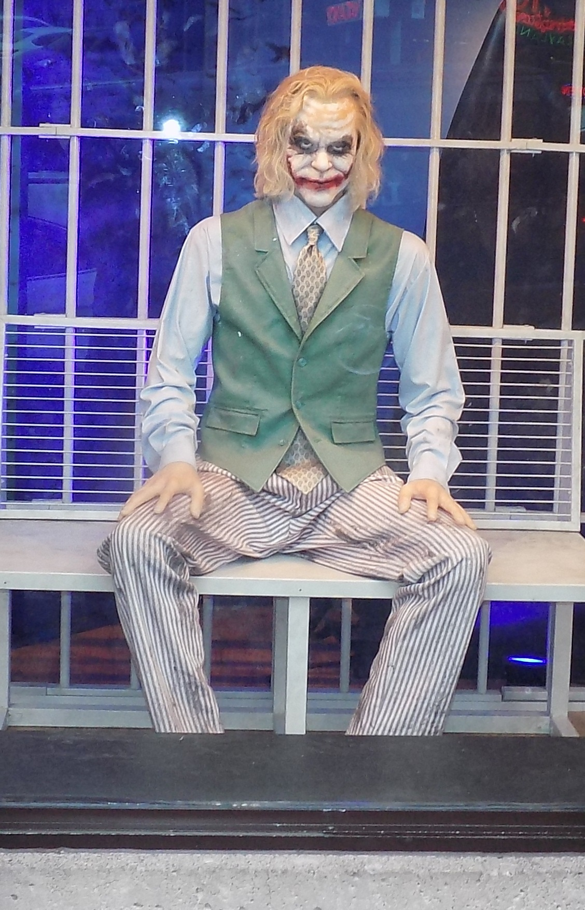
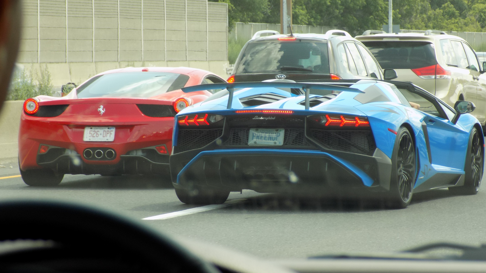
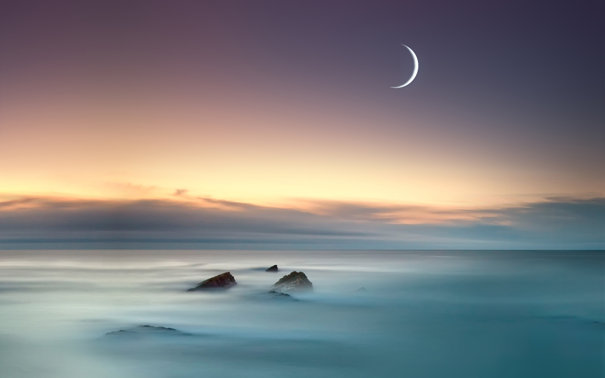

## Image Printing Based on Half toning

A halftone, or halftone image, is an image comprised of discrete dots rather than continuous tones. When viewed from a distance, the dots blur together, creating the illusion of continuous lines and shapes. By half toning an image, it can be printed using less ink. Therefore, many newspapers and magazines use half toning to print pages more efficiently.
This repository contains halftoning algorithm for grayscale images.

The implemented algorithm starts by importing a photo to convert it to a half toned image. The algorithm implements the equivalent matrix of each designated level. The algorithm converts the photo into 10-level gray scale image. Then, it creates a new image and uses the equivalent matrices to form the half-toned image.

Samples of the results:

| Original Image | Halftoned image |
| --- | --- |
| |  |
| |  |
| |  |